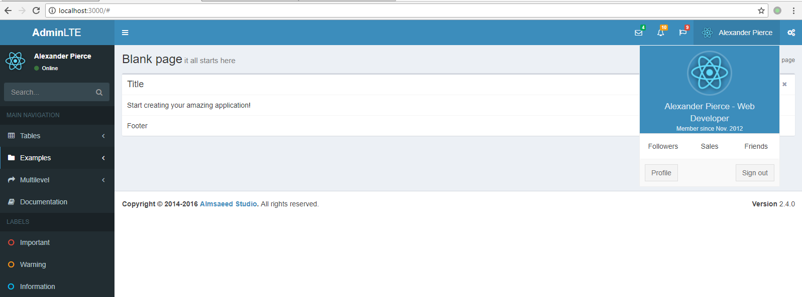

<!-- prettier-disable -->

A full-stack boilerplate template project using [expressjs](http://expressjs.com/) as backend
and [AdminLTE](https://github.com/almasaeed2010/AdminLTE/) as theme. react as front-end

This project is based on [react-starter-kit](https://github.com/kriasoft/react-starter-kit)



## Usage:

clone from github
```
git clone https://github.com/imhazige/expressjs-adminlte-project-template.git
```
install yarn if need `npm install --global yarn`

cd to the folder

run `yarn install`

develop run `yarn start`

release run `yarn start -- --release`

build run `yarn run build -- --release`, then `node build/server.js`

### note:
- the config PORT only work for built running like `node build/server.js`

More usage refer to [react-starter-kit start guid](https://github.com/kriasoft/react-starter-kit/blob/master/docs/getting-started.md) and [doc list](https://github.com/kriasoft/react-starter-kit/tree/master/docs)

## AdminLayout

see the example page: [lte-test]    (./src/routes/lte-test/index.js)

## Define client side navigate page

see [src/routes/index.js](src/routes/index.js)

in folder src/routes define page with the page name as a subfolder, need a index.js as a main script and include the component under the same folder or in the component folder do the rendering.

## Define React Component

in folder [src/components](src/components), define a component with a named folder, must include a package.json

## Static assets

in folder public

## Server side config

in the code [src/config.js](src/config.js)

## Database

connect with [sequelize](http://docs.sequelizejs.com/) src/data/sequelize.js
sequelize model defined under src/data/models

normally you need not remove the User... Models, as the passort code depend on it.

### [Sync all defined models to the DB](http://docs.sequelizejs.com/class/lib/sequelize.js~Sequelize.html#instance-method-sync)
see <src/data/models/index.js>

## Server API middleware
see <src/api/index.js>

## Logging
using [log4js](https://github.com/log4js-node/log4js-node)
see <./src/common/log.js>, config is in the <./src/config.js>

### resource load

you can import image directly like

```javascript
import userimg from './logo-small.png';
;
```

or put the image under the public folder which will be accessabile via path "/"

you can load css directly via css loader

```javascript
import s from './Navigation.css';
<div className={s.someclass}>
export default withStyles(s)(Navigation);
```

class imported from modules is able to refer to class name directly.

### ajax request
```javascript
import fetch from 'node-fetch';

fetch(url)
      .then(res => res.json())
      .then(json => {

      })
      .catch(err => {});
```

### Unit Test

###$ API Test
see <./test/api/t1.test.js> as a example
- create a test with extension .test.js
- use apitest function from <./test/api/apitest.js>


## Problems need take care

### error "Please install sqlite3 package manually"

run

```shell
yarn add sqlite3
```

### import css in css will have problem if there are relative resource.

If you import external CSS file from your internal CSS then it will be inlined and processed with CSS modules.
instead, you should import css from js

### comment style in css file will cause show css imported from js as content

for example /_ <style src="bootstrap/dist/css/bootstrap.css"></style> _/

### can not use [adminlte react](https://github.com/booleanhunter/ReactJS-AdminLTE) directly

it try to resolve the react from its own dependency - 'ERROR in ./node_modules/adminlte-reactjs/node_modules/react-dom/lib/ReactDOMInvalidARIAHook.js'

### html component used in server.js to handle many pages like error

so be careful when you think you need change the html component. or if you should consider deffiernt html for different page
if you want load different resource.

### decoratorsLegacy problem
look into this pull, https://github.com/kriasoft/react-starter-kit/pull/1608/files, add these two lines to coresponding code if you encountered these problem.


